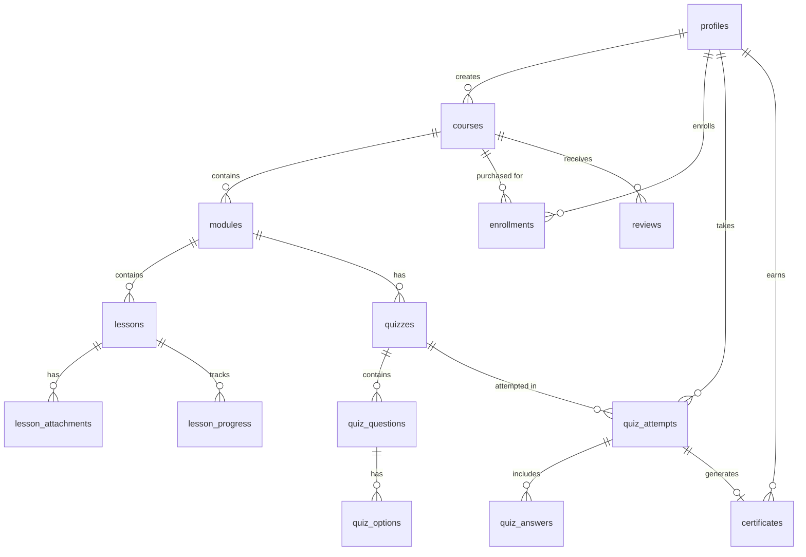

# LMS Legends — PostgreSQL Schema & TypeScript Interfaces

## 1. Entity Relationship Diagram



## 2. SQL Schema

### 2.1 Enums

```sql
CREATE TYPE user_role AS ENUM ('student', 'instructor', 'admin');
CREATE TYPE course_status AS ENUM ('draft', 'pending_review', 'published', 'archived');
CREATE TYPE lesson_type AS ENUM ('video', 'text', 'quiz');
CREATE TYPE mux_asset_status AS ENUM ('waiting', 'preparing', 'ready', 'errored');
CREATE TYPE enrollment_status AS ENUM ('active', 'refunded', 'expired');
CREATE TYPE quiz_attempt_status AS ENUM ('in_progress', 'submitted', 'graded');
CREATE TYPE question_type AS ENUM ('single_choice', 'multiple_choice', 'true_false', 'short_answer');
CREATE TYPE instructor_status AS ENUM ('pending', 'approved', 'rejected', 'suspended');
CREATE TYPE payout_status AS ENUM ('pending', 'processing', 'completed', 'failed');
```

### 2.2 Core Tables

```sql
-- ═══════════════════════════════════════════════
-- USERS & PROFILES
-- ═══════════════════════════════════════════════
CREATE TABLE profiles (
  id              UUID PRIMARY KEY REFERENCES auth.users(id) ON DELETE CASCADE,
  email           TEXT NOT NULL,
  full_name       TEXT NOT NULL,
  avatar_url      TEXT,
  bio             TEXT,
  role            user_role NOT NULL DEFAULT 'student',
  instructor_status instructor_status,
  stripe_customer_id    TEXT UNIQUE,
  stripe_connect_id     TEXT UNIQUE,
  onboarding_completed  BOOLEAN DEFAULT FALSE,
  created_at      TIMESTAMPTZ NOT NULL DEFAULT now(),
  updated_at      TIMESTAMPTZ NOT NULL DEFAULT now()
);

-- ═══════════════════════════════════════════════
-- COURSES
-- ═══════════════════════════════════════════════
CREATE TABLE courses (
  id              UUID PRIMARY KEY DEFAULT gen_random_uuid(),
  instructor_id   UUID NOT NULL REFERENCES profiles(id) ON DELETE CASCADE,
  title           TEXT NOT NULL,
  slug            TEXT NOT NULL UNIQUE,
  description     TEXT,
  short_description TEXT,
  thumbnail_url   TEXT,
  promo_video_mux_playback_id TEXT,
  price_cents     INTEGER NOT NULL DEFAULT 0,
  currency        TEXT NOT NULL DEFAULT 'usd',
  status          course_status NOT NULL DEFAULT 'draft',
  category_id     UUID REFERENCES categories(id),
  difficulty_level TEXT CHECK (difficulty_level IN ('beginner','intermediate','advanced')),
  estimated_duration_minutes INTEGER DEFAULT 0,
  published_at    TIMESTAMPTZ,
  created_at      TIMESTAMPTZ NOT NULL DEFAULT now(),
  updated_at      TIMESTAMPTZ NOT NULL DEFAULT now()
);

CREATE TABLE categories (
  id              UUID PRIMARY KEY DEFAULT gen_random_uuid(),
  name            TEXT NOT NULL UNIQUE,
  slug            TEXT NOT NULL UNIQUE,
  description     TEXT,
  parent_id       UUID REFERENCES categories(id),
  sort_order      INTEGER DEFAULT 0
);

-- ═══════════════════════════════════════════════
-- MODULES & LESSONS
-- ═══════════════════════════════════════════════
CREATE TABLE modules (
  id              UUID PRIMARY KEY DEFAULT gen_random_uuid(),
  course_id       UUID NOT NULL REFERENCES courses(id) ON DELETE CASCADE,
  title           TEXT NOT NULL,
  description     TEXT,
  sort_order      INTEGER NOT NULL DEFAULT 0,
  created_at      TIMESTAMPTZ NOT NULL DEFAULT now(),
  updated_at      TIMESTAMPTZ NOT NULL DEFAULT now()
);

CREATE TABLE lessons (
  id              UUID PRIMARY KEY DEFAULT gen_random_uuid(),
  module_id       UUID NOT NULL REFERENCES modules(id) ON DELETE CASCADE,
  title           TEXT NOT NULL,
  description     TEXT,
  lesson_type     lesson_type NOT NULL DEFAULT 'video',
  sort_order      INTEGER NOT NULL DEFAULT 0,
  is_free_preview BOOLEAN NOT NULL DEFAULT FALSE,
  -- Video fields (populated via Mux webhook)
  mux_asset_id        TEXT,
  mux_playback_id     TEXT,
  mux_asset_status    mux_asset_status DEFAULT 'waiting',
  video_duration_seconds REAL,
  -- Text lesson fields
  content_markdown    TEXT,
  -- Metadata
  created_at      TIMESTAMPTZ NOT NULL DEFAULT now(),
  updated_at      TIMESTAMPTZ NOT NULL DEFAULT now()
);

CREATE TABLE lesson_attachments (
  id              UUID PRIMARY KEY DEFAULT gen_random_uuid(),
  lesson_id       UUID NOT NULL REFERENCES lessons(id) ON DELETE CASCADE,
  file_name       TEXT NOT NULL,
  file_url        TEXT NOT NULL,
  file_type       TEXT NOT NULL,
  file_size_bytes INTEGER,
  sort_order      INTEGER DEFAULT 0,
  created_at      TIMESTAMPTZ NOT NULL DEFAULT now()
);

-- ═══════════════════════════════════════════════
-- ENROLLMENTS & PROGRESS
-- ═══════════════════════════════════════════════
CREATE TABLE enrollments (
  id              UUID PRIMARY KEY DEFAULT gen_random_uuid(),
  user_id         UUID NOT NULL REFERENCES profiles(id) ON DELETE CASCADE,
  course_id       UUID NOT NULL REFERENCES courses(id) ON DELETE CASCADE,
  status          enrollment_status NOT NULL DEFAULT 'active',
  stripe_payment_intent_id TEXT,
  price_paid_cents INTEGER NOT NULL,
  enrolled_at     TIMESTAMPTZ NOT NULL DEFAULT now(),
  refunded_at     TIMESTAMPTZ,
  UNIQUE(user_id, course_id)
);

CREATE TABLE lesson_progress (
  id              UUID PRIMARY KEY DEFAULT gen_random_uuid(),
  user_id         UUID NOT NULL REFERENCES profiles(id) ON DELETE CASCADE,
  lesson_id       UUID NOT NULL REFERENCES lessons(id) ON DELETE CASCADE,
  is_completed    BOOLEAN NOT NULL DEFAULT FALSE,
  watch_time_seconds REAL DEFAULT 0,
  last_position_seconds REAL DEFAULT 0,
  completed_at    TIMESTAMPTZ,
  updated_at      TIMESTAMPTZ NOT NULL DEFAULT now(),
  UNIQUE(user_id, lesson_id)
);

-- ═══════════════════════════════════════════════
-- QUIZZES
-- ═══════════════════════════════════════════════
CREATE TABLE quizzes (
  id              UUID PRIMARY KEY DEFAULT gen_random_uuid(),
  module_id       UUID NOT NULL REFERENCES modules(id) ON DELETE CASCADE,
  title           TEXT NOT NULL,
  description     TEXT,
  passing_score_percent INTEGER NOT NULL DEFAULT 70,
  time_limit_minutes INTEGER,
  max_attempts    INTEGER DEFAULT 3,
  shuffle_questions BOOLEAN DEFAULT TRUE,
  is_certification_exam BOOLEAN DEFAULT FALSE,
  sort_order      INTEGER DEFAULT 0,
  created_at      TIMESTAMPTZ NOT NULL DEFAULT now(),
  updated_at      TIMESTAMPTZ NOT NULL DEFAULT now()
);

CREATE TABLE quiz_questions (
  id              UUID PRIMARY KEY DEFAULT gen_random_uuid(),
  quiz_id         UUID NOT NULL REFERENCES quizzes(id) ON DELETE CASCADE,
  question_type   question_type NOT NULL DEFAULT 'single_choice',
  question_text   TEXT NOT NULL,
  explanation     TEXT,
  points          INTEGER NOT NULL DEFAULT 1,
  sort_order      INTEGER NOT NULL DEFAULT 0,
  created_at      TIMESTAMPTZ NOT NULL DEFAULT now()
);

CREATE TABLE quiz_options (
  id              UUID PRIMARY KEY DEFAULT gen_random_uuid(),
  question_id     UUID NOT NULL REFERENCES quiz_questions(id) ON DELETE CASCADE,
  option_text     TEXT NOT NULL,
  is_correct      BOOLEAN NOT NULL DEFAULT FALSE,
  sort_order      INTEGER NOT NULL DEFAULT 0
);

CREATE TABLE quiz_attempts (
  id              UUID PRIMARY KEY DEFAULT gen_random_uuid(),
  quiz_id         UUID NOT NULL REFERENCES quizzes(id) ON DELETE CASCADE,
  user_id         UUID NOT NULL REFERENCES profiles(id) ON DELETE CASCADE,
  status          quiz_attempt_status NOT NULL DEFAULT 'in_progress',
  score_percent   REAL,
  total_points    INTEGER,
  earned_points   INTEGER,
  passed          BOOLEAN,
  started_at      TIMESTAMPTZ NOT NULL DEFAULT now(),
  submitted_at    TIMESTAMPTZ,
  graded_at       TIMESTAMPTZ
);

CREATE TABLE quiz_answers (
  id              UUID PRIMARY KEY DEFAULT gen_random_uuid(),
  attempt_id      UUID NOT NULL REFERENCES quiz_attempts(id) ON DELETE CASCADE,
  question_id     UUID NOT NULL REFERENCES quiz_questions(id) ON DELETE CASCADE,
  selected_option_ids UUID[] DEFAULT '{}',
  text_answer     TEXT,
  is_correct      BOOLEAN,
  points_earned   INTEGER DEFAULT 0,
  UNIQUE(attempt_id, question_id)
);

-- ═══════════════════════════════════════════════
-- CERTIFICATES
-- ═══════════════════════════════════════════════
CREATE TABLE certificates (
  id                  UUID PRIMARY KEY DEFAULT gen_random_uuid(),
  user_id             UUID NOT NULL REFERENCES profiles(id) ON DELETE CASCADE,
  course_id           UUID NOT NULL REFERENCES courses(id) ON DELETE CASCADE,
  quiz_attempt_id     UUID REFERENCES quiz_attempts(id),
  certificate_number  TEXT NOT NULL UNIQUE,
  pdf_url             TEXT,
  issued_at           TIMESTAMPTZ NOT NULL DEFAULT now(),
  UNIQUE(user_id, course_id)
);

-- ═══════════════════════════════════════════════
-- REVIEWS & PAYOUTS
-- ═══════════════════════════════════════════════
CREATE TABLE reviews (
  id              UUID PRIMARY KEY DEFAULT gen_random_uuid(),
  user_id         UUID NOT NULL REFERENCES profiles(id) ON DELETE CASCADE,
  course_id       UUID NOT NULL REFERENCES courses(id) ON DELETE CASCADE,
  rating          INTEGER NOT NULL CHECK (rating BETWEEN 1 AND 5),
  comment         TEXT,
  created_at      TIMESTAMPTZ NOT NULL DEFAULT now(),
  updated_at      TIMESTAMPTZ NOT NULL DEFAULT now(),
  UNIQUE(user_id, course_id)
);

CREATE TABLE payouts (
  id                  UUID PRIMARY KEY DEFAULT gen_random_uuid(),
  instructor_id       UUID NOT NULL REFERENCES profiles(id) ON DELETE CASCADE,
  enrollment_id       UUID NOT NULL REFERENCES enrollments(id),
  gross_amount_cents  INTEGER NOT NULL,
  platform_fee_cents  INTEGER NOT NULL,
  net_amount_cents    INTEGER NOT NULL,
  stripe_transfer_id  TEXT,
  status              payout_status NOT NULL DEFAULT 'pending',
  created_at          TIMESTAMPTZ NOT NULL DEFAULT now(),
  completed_at        TIMESTAMPTZ
);
```

### 2.3 Key RLS Policies (Examples)

```sql
-- Students can only read their own progress
ALTER TABLE lesson_progress ENABLE ROW LEVEL SECURITY;
CREATE POLICY "Users read own progress" ON lesson_progress
  FOR SELECT USING (auth.uid() = user_id);
CREATE POLICY "Users update own progress" ON lesson_progress
  FOR UPDATE USING (auth.uid() = user_id);

-- Instructors can only modify their own courses
ALTER TABLE courses ENABLE ROW LEVEL SECURITY;
CREATE POLICY "Instructors manage own courses" ON courses
  FOR ALL USING (auth.uid() = instructor_id);
CREATE POLICY "Anyone reads published courses" ON courses
  FOR SELECT USING (status = 'published');

-- Quiz answers: correct options are NEVER sent to the client
-- Enforced via a Supabase view that strips `is_correct`
CREATE VIEW quiz_options_public AS
  SELECT id, question_id, option_text, sort_order
  FROM quiz_options;
```

## 3. TypeScript Interfaces

```typescript
// types/database.ts

export type UserRole = 'student' | 'instructor' | 'admin';
export type CourseStatus = 'draft' | 'pending_review' | 'published' | 'archived';
export type LessonType = 'video' | 'text' | 'quiz';
export type MuxAssetStatus = 'waiting' | 'preparing' | 'ready' | 'errored';
export type EnrollmentStatus = 'active' | 'refunded' | 'expired';
export type QuizAttemptStatus = 'in_progress' | 'submitted' | 'graded';
export type QuestionType = 'single_choice' | 'multiple_choice' | 'true_false' | 'short_answer';

export interface Profile {
  id: string;
  email: string;
  full_name: string;
  avatar_url: string | null;
  bio: string | null;
  role: UserRole;
  stripe_customer_id: string | null;
  stripe_connect_id: string | null;
  created_at: string;
  updated_at: string;
}

export interface Course {
  id: string;
  instructor_id: string;
  title: string;
  slug: string;
  description: string | null;
  short_description: string | null;
  thumbnail_url: string | null;
  price_cents: number;
  currency: string;
  status: CourseStatus;
  category_id: string | null;
  difficulty_level: 'beginner' | 'intermediate' | 'advanced' | null;
  estimated_duration_minutes: number;
  published_at: string | null;
  created_at: string;
  updated_at: string;
  // Relations
  modules?: Module[];
  instructor?: Profile;
}

export interface Module {
  id: string;
  course_id: string;
  title: string;
  description: string | null;
  sort_order: number;
  lessons?: Lesson[];
  quizzes?: Quiz[];
}

export interface Lesson {
  id: string;
  module_id: string;
  title: string;
  lesson_type: LessonType;
  sort_order: number;
  is_free_preview: boolean;
  mux_asset_id: string | null;
  mux_playback_id: string | null;
  mux_asset_status: MuxAssetStatus;
  video_duration_seconds: number | null;
  content_markdown: string | null;
}

export interface Enrollment {
  id: string;
  user_id: string;
  course_id: string;
  status: EnrollmentStatus;
  price_paid_cents: number;
  enrolled_at: string;
}

export interface LessonProgress {
  id: string;
  user_id: string;
  lesson_id: string;
  is_completed: boolean;
  watch_time_seconds: number;
  last_position_seconds: number;
  completed_at: string | null;
}

export interface Quiz {
  id: string;
  module_id: string;
  title: string;
  passing_score_percent: number;
  time_limit_minutes: number | null;
  max_attempts: number;
  shuffle_questions: boolean;
  is_certification_exam: boolean;
}

export interface QuizQuestion {
  id: string;
  quiz_id: string;
  question_type: QuestionType;
  question_text: string;
  explanation: string | null;
  points: number;
  sort_order: number;
}

export interface QuizAttempt {
  id: string;
  quiz_id: string;
  user_id: string;
  status: QuizAttemptStatus;
  score_percent: number | null;
  passed: boolean | null;
  started_at: string;
  submitted_at: string | null;
}

export interface Certificate {
  id: string;
  user_id: string;
  course_id: string;
  quiz_attempt_id: string | null;
  certificate_number: string;
  pdf_url: string | null;
  issued_at: string;
}
```
