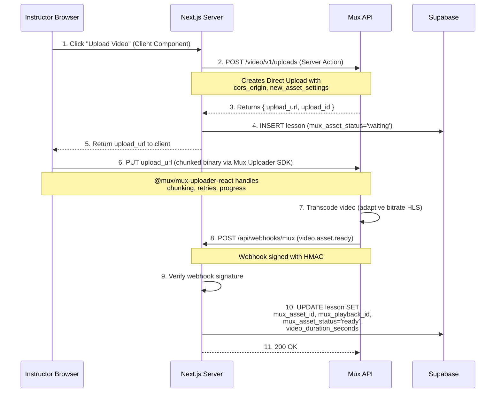
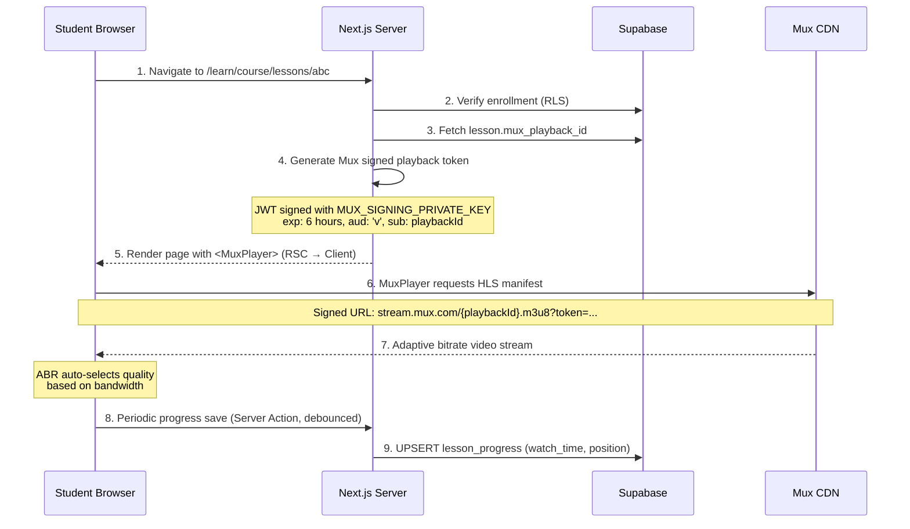

# LMS Legends — Video Streaming Workflow

## 1. Video Upload Flow (Instructor)



### Step-by-Step Details

#### Step 2 — Server Action: Create Upload URL

```typescript
// actions/lessons.ts
'use server';

import Mux from '@mux/mux-node';

const mux = new Mux({
  tokenId: process.env.MUX_TOKEN_ID!,
  tokenSecret: process.env.MUX_TOKEN_SECRET!,
});

export async function createVideoUploadUrl(lessonId: string) {
  // Auth check: verify caller is the course instructor
  const supabase = await createServerClient();
  const { data: { user } } = await supabase.auth.getUser();
  // ... ownership verification ...

  const upload = await mux.video.uploads.create({
    cors_origin: process.env.NEXT_PUBLIC_APP_URL!,
    new_asset_settings: {
      playback_policy: ['signed'],     // Require signed tokens
      encoding_tier: 'smart',          // Cost-optimized transcoding
      max_resolution_tier: '1080p',
      passthrough: lessonId,           // Links asset back to our lesson
    },
  });

  // Save upload reference
  await supabase
    .from('lessons')
    .update({ mux_asset_status: 'preparing' })
    .eq('id', lessonId);

  return { uploadUrl: upload.url, uploadId: upload.id };
}
```

#### Step 6 — Client Component: Mux Uploader

```tsx
'use client';

import MuxUploader from '@mux/mux-uploader-react';
import { createVideoUploadUrl } from '@/actions/lessons';

export function VideoUploader({ lessonId }: { lessonId: string }) {
  const [uploadUrl, setUploadUrl] = useState<string | null>(null);

  async function handleStartUpload() {
    const { uploadUrl } = await createVideoUploadUrl(lessonId);
    setUploadUrl(uploadUrl);
  }

  return (
    <div>
      {!uploadUrl ? (
        <Button onClick={handleStartUpload}>Upload Video</Button>
      ) : (
        <MuxUploader
          endpoint={uploadUrl}
          onSuccess={() => toast.success('Upload complete! Processing...')}
          onError={(e) => toast.error(`Upload failed: ${e.detail}`)}
        />
      )}
    </div>
  );
}
```

#### Steps 8-10 — Webhook Handler

```typescript
// app/api/webhooks/mux/route.ts
import Mux from '@mux/mux-node';

const mux = new Mux();

export async function POST(request: Request) {
  const body = await request.text();
  const signature = request.headers.get('mux-signature')!;

  // Verify webhook signature
  const isValid = mux.webhooks.verifySignature(
    body,
    { 'mux-signature': signature },
    process.env.MUX_WEBHOOK_SIGNING_SECRET!
  );
  if (!isValid) return new Response('Invalid signature', { status: 401 });

  const event = JSON.parse(body);

  if (event.type === 'video.asset.ready') {
    const asset = event.data;
    const lessonId = asset.passthrough; // We set this during upload

    const supabase = createAdminClient(); // Service role
    await supabase
      .from('lessons')
      .update({
        mux_asset_id: asset.id,
        mux_playback_id: asset.playback_ids[0].id,
        mux_asset_status: 'ready',
        video_duration_seconds: asset.duration,
      })
      .eq('id', lessonId);
  }

  if (event.type === 'video.asset.errored') {
    const lessonId = event.data.passthrough;
    const supabase = createAdminClient();
    await supabase
      .from('lessons')
      .update({ mux_asset_status: 'errored' })
      .eq('id', lessonId);
  }

  return new Response('OK', { status: 200 });
}
```

---

## 2. Video Playback Flow (Student)



### Signed Token Generation

```typescript
// lib/mux/tokens.ts
import jwt from 'jsonwebtoken';

export function generateMuxPlaybackToken(playbackId: string): string {
  const signingKey = Buffer.from(
    process.env.MUX_SIGNING_PRIVATE_KEY!,
    'base64'
  );

  return jwt.sign(
    {
      sub: playbackId,
      aud: 'v',          // 'v' = video playback
      exp: Math.floor(Date.now() / 1000) + 6 * 60 * 60, // 6 hours
      kid: process.env.MUX_SIGNING_KEY_ID!,
    },
    signingKey,
    { algorithm: 'RS256' }
  );
}
```

### Player Component with Progress Tracking

```tsx
// components/lessons/video-player.tsx
'use client';

import MuxPlayer from '@mux/mux-player-react';
import { saveLessonProgress, markLessonComplete } from '@/actions/lessons';
import { useRef, useCallback } from 'react';

interface VideoPlayerProps {
  playbackId: string;
  playbackToken: string;
  lessonId: string;
  initialPosition: number;
}

export function VideoPlayer({
  playbackId, playbackToken, lessonId, initialPosition
}: VideoPlayerProps) {
  const lastSaved = useRef(0);

  const handleTimeUpdate = useCallback((e: Event) => {
    const player = e.target as HTMLVideoElement;
    const current = player.currentTime;

    // Debounce: save every 30 seconds
    if (current - lastSaved.current > 30) {
      lastSaved.current = current;
      saveLessonProgress(lessonId, {
        last_position_seconds: current,
        watch_time_seconds: current,
      });
    }
  }, [lessonId]);

  const handleEnded = useCallback(() => {
    markLessonComplete(lessonId);
  }, [lessonId]);

  return (
    <MuxPlayer
      playbackId={playbackId}
      tokens={{ playback: playbackToken }}
      startTime={initialPosition}
      onTimeUpdate={handleTimeUpdate}
      onEnded={handleEnded}
      accentColor="#6366f1"
      metadata={{ video_title: 'Lesson Video' }}
    />
  );
}
```

## 3. Security Measures

| Threat | Mitigation |
|---|---|
| Unauthorized video access | Mux signed playback tokens (6h TTL), enrollment verified server-side before token generation |
| Video URL sharing | `playback_policy: ['signed']` — bare playback IDs cannot stream |
| Upload abuse | Server Action verifies instructor role + course ownership before creating upload URL |
| Webhook spoofing | HMAC signature verification on all Mux webhooks |
| Download / screen capture | Mux DRM (Widevine/FairPlay) available as upgrade; watermarking via Mux overlay |
