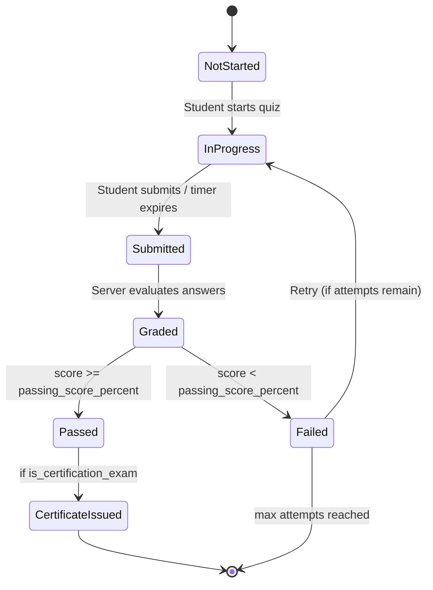
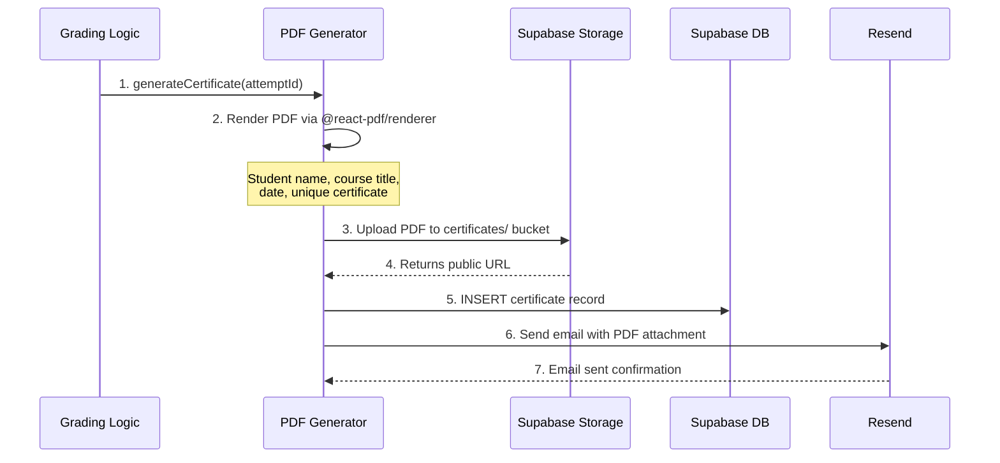

# LMS Legends — Quiz & Certification Logic

## 1. Quiz Architecture Overview

> **Core Security Principle:** All quiz grading happens server-side. The client never receives correct answers until after submission.



## 2. Anti-Cheating Measures

| Threat | Server-Side Mitigation |
|---|---|
| Inspecting correct answers | `quiz_options_public` view strips `is_correct` column. Client only sees `(id, option_text, sort_order)`. |
| Submitting after time expires | Server compares `submitted_at - started_at` against `time_limit_minutes`. Rejects if exceeded. |
| Multiple submissions | DB constraint: `status='in_progress'` checked before accepting. Once `submitted`, no further writes. |
| Brute-force retries | `max_attempts` enforced server-side: `COUNT(*) FROM quiz_attempts WHERE quiz_id=? AND user_id=?`. |
| Answer tampering | `quiz_answers` are evaluated against `quiz_options.is_correct` at grading time, not client-supplied correctness. |
| Question harvesting | `shuffle_questions=true` randomizes order. Questions can be drawn from a pool (future: question banks). |

## 3. Quiz Taking Flow

### Step 1 — Start Quiz (Server Action)

```typescript
// actions/quizzes.ts
'use server';

export async function startQuizAttempt(quizId: string) {
  const supabase = await createServerClient();
  const { data: { user } } = await supabase.auth.getUser();

  // 1. Check enrollment
  // 2. Check max attempts not exceeded
  const { count } = await supabase
    .from('quiz_attempts')
    .select('*', { count: 'exact', head: true })
    .eq('quiz_id', quizId)
    .eq('user_id', user!.id);

  const { data: quiz } = await supabase
    .from('quizzes')
    .select('max_attempts')
    .eq('id', quizId)
    .single();

  if (count! >= quiz!.max_attempts) {
    throw new Error('Maximum attempts reached');
  }

  // 3. Create attempt
  const { data: attempt } = await supabase
    .from('quiz_attempts')
    .insert({
      quiz_id: quizId,
      user_id: user!.id,
      status: 'in_progress',
      started_at: new Date().toISOString(),
    })
    .select()
    .single();

  // 4. Fetch questions (WITHOUT correct answers — via public view)
  const { data: questions } = await supabase
    .from('quiz_questions')
    .select('id, question_type, question_text, points, sort_order')
    .eq('quiz_id', quizId)
    .order(quiz!.shuffle_questions ? 'sort_order' : 'sort_order'); // shuffle on client

  // Get options via the safe view
  const { data: options } = await supabase
    .from('quiz_options_public')
    .select('*')
    .in('question_id', questions!.map(q => q.id));

  return { attempt, questions, options };
}
```

### Step 2 — Submit Quiz (Server Action)

```typescript
export async function submitQuizAttempt(
  attemptId: string,
  answers: { questionId: string; selectedOptionIds: string[]; textAnswer?: string }[]
) {
  const supabase = await createServerClient();
  const { data: { user } } = await supabase.auth.getUser();

  // 1. Verify attempt belongs to user and is in_progress
  const { data: attempt } = await supabase
    .from('quiz_attempts')
    .select('*, quizzes(*)')
    .eq('id', attemptId)
    .eq('user_id', user!.id)
    .eq('status', 'in_progress')
    .single();

  if (!attempt) throw new Error('Invalid attempt');

  // 2. Check time limit
  const quiz = attempt.quizzes;
  if (quiz.time_limit_minutes) {
    const elapsed = (Date.now() - new Date(attempt.started_at).getTime()) / 60000;
    if (elapsed > quiz.time_limit_minutes + 0.5) { // 30s grace
      throw new Error('Time limit exceeded');
    }
  }

  // 3. Save answers
  await supabase.from('quiz_answers').insert(
    answers.map(a => ({
      attempt_id: attemptId,
      question_id: a.questionId,
      selected_option_ids: a.selectedOptionIds,
      text_answer: a.textAnswer,
    }))
  );

  // 4. Update attempt status
  await supabase
    .from('quiz_attempts')
    .update({ status: 'submitted', submitted_at: new Date().toISOString() })
    .eq('id', attemptId);

  // 5. Grade (see below)
  return gradeQuizAttempt(attemptId);
}
```

### Step 3 — Grading (Server-Only)

```typescript
async function gradeQuizAttempt(attemptId: string) {
  const supabase = createAdminClient(); // Service role to read is_correct

  // Fetch all answers with their correct options
  const { data: answers } = await supabase
    .from('quiz_answers')
    .select('*, quiz_questions!inner(points, question_type)')
    .eq('attempt_id', attemptId);

  let totalPoints = 0;
  let earnedPoints = 0;

  for (const answer of answers!) {
    const question = answer.quiz_questions;
    totalPoints += question.points;

    // Fetch correct option IDs for this question
    const { data: correctOptions } = await supabase
      .from('quiz_options')
      .select('id')
      .eq('question_id', answer.question_id)
      .eq('is_correct', true);

    const correctIds = new Set(correctOptions!.map(o => o.id));
    const selectedIds = new Set(answer.selected_option_ids || []);

    // Exact match grading
    const isCorrect =
      correctIds.size === selectedIds.size &&
      [...correctIds].every(id => selectedIds.has(id));

    earnedPoints += isCorrect ? question.points : 0;

    // Update individual answer
    await supabase
      .from('quiz_answers')
      .update({ is_correct: isCorrect, points_earned: isCorrect ? question.points : 0 })
      .eq('id', answer.id);
  }

  const scorePercent = totalPoints > 0 ? (earnedPoints / totalPoints) * 100 : 0;

  // Get passing threshold
  const { data: attempt } = await supabase
    .from('quiz_attempts')
    .select('quiz_id, quizzes(passing_score_percent, is_certification_exam)')
    .eq('id', attemptId)
    .single();

  const passed = scorePercent >= attempt!.quizzes.passing_score_percent;

  // Update attempt with results
  await supabase
    .from('quiz_attempts')
    .update({
      status: 'graded',
      score_percent: scorePercent,
      total_points: totalPoints,
      earned_points: earnedPoints,
      passed,
      graded_at: new Date().toISOString(),
    })
    .eq('id', attemptId);

  // Trigger certificate if certification exam passed
  if (passed && attempt!.quizzes.is_certification_exam) {
    await generateCertificate(attemptId);
  }

  return { scorePercent, passed, earnedPoints, totalPoints };
}
```

## 4. Certificate Generation

### Trigger Conditions

1. Quiz is flagged `is_certification_exam = true`
2. Student's `score_percent >= passing_score_percent`
3. No existing certificate for this `(user_id, course_id)` pair

### Generation Flow



### PDF Template (Server-side)

```typescript
// lib/certificates/generate-pdf.ts
import { renderToBuffer } from '@react-pdf/renderer';
import { CertificateDocument } from './certificate-template';
import { nanoid } from 'nanoid';

export async function generateCertificate(attemptId: string) {
  const supabase = createAdminClient();

  // Fetch all needed data
  const { data: attempt } = await supabase
    .from('quiz_attempts')
    .select(`
      *,
      profiles!user_id(full_name, email),
      quizzes!quiz_id(
        modules!module_id(
          courses!course_id(id, title, instructor_id, profiles!instructor_id(full_name))
        )
      )
    `)
    .eq('id', attemptId)
    .single();

  const certNumber = `LMS-${nanoid(10).toUpperCase()}`;
  const verificationUrl = `${process.env.NEXT_PUBLIC_APP_URL}/verify/${certNumber}`;

  // Render PDF
  const pdfBuffer = await renderToBuffer(
    <CertificateDocument
      studentName={attempt.profiles.full_name}
      courseTitle={attempt.quizzes.modules.courses.title}
      instructorName={attempt.quizzes.modules.courses.profiles.full_name}
      certificateNumber={certNumber}
      issuedDate={new Date()}
      scorePercent={attempt.score_percent}
      verificationUrl={verificationUrl}
    />
  );

  // Upload to Supabase Storage
  const filePath = `certificates/${certNumber}.pdf`;
  await supabase.storage
    .from('certificates')
    .upload(filePath, pdfBuffer, { contentType: 'application/pdf' });

  const { data: { publicUrl } } = supabase.storage
    .from('certificates')
    .getPublicUrl(filePath);

  // Save record
  await supabase.from('certificates').insert({
    user_id: attempt.user_id,
    course_id: attempt.quizzes.modules.courses.id,
    quiz_attempt_id: attemptId,
    certificate_number: certNumber,
    pdf_url: publicUrl,
  });

  // Send email
  await resend.emails.send({
    from: process.env.RESEND_FROM_EMAIL!,
    to: attempt.profiles.email,
    subject: `Your Certificate for "${attempt.quizzes.modules.courses.title}"`,
    react: CertificateEmailTemplate({ ... }),
    attachments: [{ filename: `${certNumber}.pdf`, content: pdfBuffer }],
  });
}
```

### Certificate Verification (Public)

- `GET /verify/[certNumber]` — public page showing certificate validity
- Queries `certificates` table by `certificate_number`
- Displays: student name, course, date, valid/invalid status
