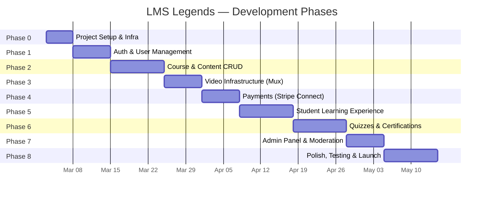

# LMS Legends — Milestones & Phased Rollout

## Development Timeline Overview

---

## Phase 0 — Project Setup & Infrastructure (Week 1)

**Goal:** Establish the development environment, CI/CD, and all third-party service accounts.

| # | Task | Details |
|---|---|---|
| 0.1 | Initialize project | Next.js 16, TypeScript strict, Tailwind v4, pnpm |
| 0.2 | Setup shadcn/ui | Install CLI, configure theme, add core components (Button, Card, Dialog, Form, Input, Table, Tabs, Toast) |
| 0.3 | Supabase project | Create project, configure RLS defaults, set up local dev with `supabase init` + `supabase start` |
| 0.4 | DB migrations | Run initial migration with all tables from schema spec |
| 0.5 | Mux account | Create account, generate API tokens, set webhook endpoint |
| 0.6 | Stripe account | Create platform account, enable Connect, configure webhook endpoints |
| 0.7 | Resend account | Create account, verify domain, generate API key |
| 0.8 | Environment config | `.env.local`, `.env.example`, Vercel env vars |
| 0.9 | CI/CD | GitHub Actions: lint → type-check → build → deploy (Vercel) |
| 0.10 | Dev tooling | Prettier, ESLint, Husky pre-commit, `supabase gen types typescript` script |

**Deliverable:** Running dev environment with all services connected.

---

## Phase 1 — Authentication & User Management (Week 2)

**Goal:** Complete auth flow with role-based access control.

| # | Task | Details |
|---|---|---|
| 1.1 | Supabase Auth setup | Configure email/password, Google OAuth, magic link |
| 1.2 | Auth pages | Login, Register, Forgot Password, Verify Email (shadcn forms) |
| 1.3 | Session middleware | `middleware.ts` — cookie refresh, protected route redirect |
| 1.4 | Profile system | `profiles` table auto-creation via DB trigger on `auth.users` insert |
| 1.5 | RBAC middleware | Role-based layout guards for student, instructor, admin routes |
| 1.6 | RLS policies | All tables: owner-based policies, role-based read access |
| 1.7 | Profile settings page | Avatar upload (Supabase Storage), name, bio, password change |

**Deliverable:** Users can register, login, and access role-appropriate dashboards.

---

## Phase 2 — Course & Content Management (Weeks 3–4)

**Goal:** Instructors can create full course structures with modules and text lessons.

| # | Task | Details |
|---|---|---|
| 2.1 | Instructor onboarding | Application form, admin approval workflow |
| 2.2 | Course CRUD | Create, edit, archive courses with rich metadata |
| 2.3 | Slug generation | Auto-generate unique slugs from titles |
| 2.4 | Category system | Hierarchical categories with admin management |
| 2.5 | Module builder | Create/reorder modules within a course (drag-and-drop with `@dnd-kit`) |
| 2.6 | Lesson builder | Create/reorder lessons within modules |
| 2.7 | Text lessons | Markdown editor with preview (`@uiw/react-md-editor`) |
| 2.8 | File attachments | Upload PDFs/resources to Supabase Storage, link to lessons |
| 2.9 | Thumbnail upload | Course thumbnail with image cropping |
| 2.10 | Course detail page | Public course page with syllabus, instructor info, SEO metadata |
| 2.11 | Course catalog | Browse, search (Supabase full-text search), filter by category/price/level |

**Deliverable:** Instructors can build full course structures; students can browse the catalog.

---

## Phase 3 — Video Infrastructure (Week 5)

**Goal:** Full video upload and playback via Mux.

| # | Task | Details |
|---|---|---|
| 3.1 | Mux upload integration | Server Action creates Direct Upload URL, client uses `@mux/mux-uploader-react` |
| 3.2 | Webhook handler | `video.asset.ready` / `video.asset.errored` → update lesson status |
| 3.3 | Signed playback tokens | RS256 JWT generation for `@mux/mux-player-react` |
| 3.4 | Video player component | `<MuxPlayer>` with adaptive bitrate, captions support |
| 3.5 | Upload progress UI | Real-time upload progress, transcoding status indicators |
| 3.6 | Video management | Instructor can replace/delete videos, view asset status |

**Deliverable:** Instructors upload videos; enrolled students stream HLS video securely.

---

## Phase 4 — Payments & Stripe Connect (Week 6)

**Goal:** Students can purchase courses; instructors receive payouts.

| # | Task | Details |
|---|---|---|
| 4.1 | Stripe Connect onboarding | Instructor connects Stripe account via OAuth flow |
| 4.2 | Checkout flow | Server Action creates Stripe Checkout Session with `transfer_data` |
| 4.3 | Webhook handler | `checkout.session.completed` → create enrollment + payout record |
| 4.4 | Revenue split | Platform fee (configurable %, default 15%) + Transfer to instructor |
| 4.5 | Purchase confirmation | Success page + receipt email via Resend |
| 4.6 | Instructor revenue page | Earnings dashboard, payout history |
| 4.7 | Refund flow | Admin-initiated refunds with automatic transfer reversal |
| 4.8 | Free courses | Support $0 price with instant enrollment (skip Stripe) |

**Deliverable:** End-to-end purchase flow with automatic instructor payouts.

---

## Phase 5 — Student Learning Experience (Weeks 7–8)

**Goal:** Complete course consumption experience with progress tracking.

| # | Task | Details |
|---|---|---|
| 5.1 | Course player layout | Sidebar with module/lesson navigation, completion checkmarks |
| 5.2 | Video progress tracking | Auto-save watch position every 30s, resume on return |
| 5.3 | Lesson completion | Mark complete on video end or manual toggle |
| 5.4 | Course progress bar | Overall percentage based on completed lessons |
| 5.5 | Student dashboard | Enrolled courses grid, continue learning CTA, progress overview |
| 5.6 | Review system | Star rating + comment after enrollment, average displayed on course page |
| 5.7 | Free preview lessons | Public access to `is_free_preview` lessons without enrollment |
| 5.8 | Responsive design | Mobile-optimized video player and lesson navigation |

**Deliverable:** Students can consume content with full progress tracking and reviews.

---

## Phase 6 — Quizzes & Certifications (Weeks 9–10)

**Goal:** Secure quiz system with automatic certificate generation.

| # | Task | Details |
|---|---|---|
| 6.1 | Quiz builder (instructor) | CRUD questions/options, set passing score, time limits |
| 6.2 | Question types | Single choice, multiple choice, true/false, short answer |
| 6.3 | Quiz taking UI | Interactive form with countdown timer, question navigation |
| 6.4 | Server-side grading | Secure evaluation, never expose `is_correct` to client |
| 6.5 | Results display | Score breakdown, correct/incorrect indicators, explanations |
| 6.6 | Attempt management | Max attempts enforcement, attempt history |
| 6.7 | Certificate generation | `@react-pdf/renderer` template with QR verification code |
| 6.8 | Certificate email | Send PDF via Resend on quiz pass |
| 6.9 | Verification page | Public `/verify/[certNumber]` for certificate authenticity |
| 6.10 | Certificates list | Student dashboard showing all earned certificates |

**Deliverable:** Complete quiz-to-certificate pipeline with anti-cheating measures.

---

## Phase 7 — Admin Panel & Moderation (Week 11)

**Goal:** Platform administrators can manage all aspects of the system.

| # | Task | Details |
|---|---|---|
| 7.1 | Admin dashboard | KPI cards: total users, revenue, active courses, enrollments |
| 7.2 | User management | Search, view, ban/unban users, change roles |
| 7.3 | Course review queue | Approve/reject courses submitted for publication |
| 7.4 | Instructor applications | Review and approve/reject instructor applications |
| 7.5 | Category management | CRUD categories with hierarchical structure |
| 7.6 | Payout oversight | View all platform payouts, flag issues |
| 7.7 | Platform settings | Configurable fee percentage, default course settings |

**Deliverable:** Admins have full control over platform operations.

---

## Phase 8 — Polish, Testing & Launch Prep (Weeks 12–13)

**Goal:** Production-ready application with comprehensive testing.

| # | Task | Details |
|---|---|---|
| 8.1 | E2E testing | Playwright tests for critical flows (auth, purchase, video, quiz) |
| 8.2 | Unit tests | Vitest for Server Actions, grading logic, token generation |
| 8.3 | Performance audit | Lighthouse CI, Core Web Vitals optimization |
| 8.4 | SEO optimization | Metadata, OG images, sitemap.xml, robots.txt |
| 8.5 | Accessibility audit | WCAG 2.1 AA compliance, keyboard navigation, ARIA labels |
| 8.6 | Error handling | Global error boundary, Sentry integration, user-friendly error pages |
| 8.7 | Rate limiting | API route protection with Vercel WAF or `@upstash/ratelimit` |
| 8.8 | Security hardening | CSP headers, CSRF protection, input sanitization |
| 8.9 | Documentation | API docs, deployment runbook, README |
| 8.10 | Staging deployment | Full staging environment on Vercel with test data |
| 8.11 | Production launch | DNS, custom domain, monitoring, launch checklist |

**Deliverable:** Production-launched MVP.

---

## MVP Definition (Phases 0–6)

The **Minimum Viable Product** includes:

- ✅ User auth with roles (student, instructor, admin)
- ✅ Course creation with modules, lessons, and video upload
- ✅ Course catalog with search and filters
- ✅ Stripe checkout with instructor payouts
- ✅ Video streaming with progress tracking
- ✅ Quiz system with server-side grading
- ✅ PDF certificate generation

**Post-MVP features** (not in this spec):

- Live sessions / webinars
- Discussion forums per course
- Coupon / discount codes
- Subscription plans (in addition to one-time purchase)
- Mobile app (React Native)
- AI-powered course recommendations
- Learning paths (multi-course bundles)
